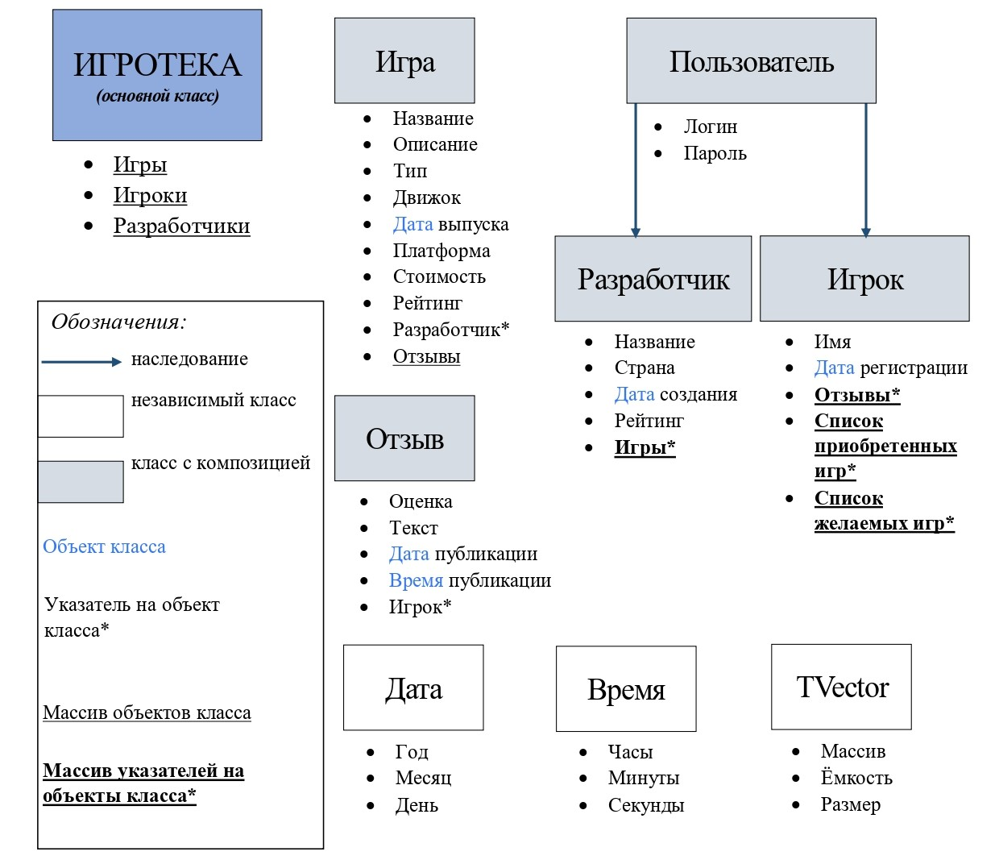

# Проект с индивидуальной предметной областью

**Выбранная предметная область:** ИГРОТЕКА.

**Цель работы:** реализовать платформу для навигации по играм, их оценивания пользователями.

## Задачи проекта

1. Реализовать платформу для поиска, оценки и покупки игр.
2. Приложение должно обеспечивать возможность пользователю:
* создать свой профиль;
* искать игры, использую фильтрацию по жанрам, рейтингам, разработчикам и другим параметрам;
* оставлять отзывы и оценки играм;
* создавать список покупок / желаемого;
* и др.

## Функциональные требования

Приложение реализуется в виде windows-приложения с удобным навигационным меню, качественным отображением информации.

Основные возможности, которые будут предусмотрены приложением:

1. Приложение реализуется с авторизацией по логину / паролю.
2. Основной режим работы приложения предоставляет пользователю необходимые ему функции.
3. Доступ к особому режиму создания / изменения разработчиков будет осуществляться по особому логину / паролю, которые будут выданы администратору.
4. Все данные будут храниться в csv-формате и подтягиваться при очередном запуске приложения.

## Схема классов

## Класс вектор
[Исследование std::vector](/source/STL_vector.docx)